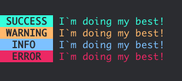

# I'm doing my best CLI

## Simple and functional Node or Go To Do List


### Node


visit the oficial [nodejs oficial page](page https://nodejs.org)

#### Commands

##### List tasks

List all your tasks

```node index.js list```

##### Create task

Create a single task. By default the task is created with false complete state

`node index.js create -d "Example for task description"`

##### Update task

Update the complete state for a task

`node index.js update -d "Example for task description" -c true`

##### Remove task

Remove a single task

`node index.js remove -d "Example for task description"`


#### Options

##### Description

String  description for a task

`--description -d <String>`

##### Complete

Boolean state (complete/not complete) for a task

`--complete -c <Boolean>`

#### Logs messages

You can use the global logs to our CLI

```javascript

const { error } = require('./logs/error');
const { warning } = require('./logs/warning');
const { info } = require('./logs/info');
const { success } = require('./logs/success');


success('I`m doing my best!');
warning('I`m doing my best!');
info('I`m doing my best!');
error('I`m doing my best!');
```




